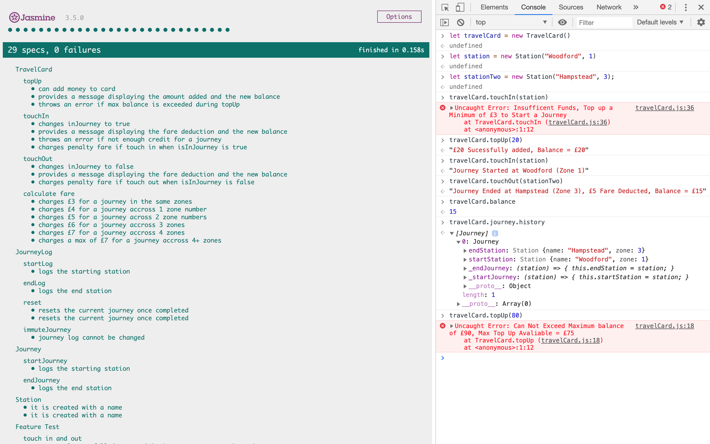

# London Travel

A simple Object Orientated app, simulating simulating the TFL Oystercard in London - functions via the console on a web browser. Test driven in JavaScript ES6 with the Jasmine library, this showcases good coding prncipals: Encapsulation, DRY, SRP, TDD and dependancy injection, built on the a set of user stories. The 'spyOn' feature of Jasmine was also used to seperate the concerns of the spec files, spyOnObj was used for test doubles, to unit test in isolation, and a grouped feature test was conducted with the real objects to thoroughly test the entire program.

---

## User Stories

```
In order to use public transport
As a customer
I want money on my card

In order to keep using public transport
As a customer
I want to add money to my card

In order to protect my money
As a customer
I don't want to put too much money on my card

In order to pay for my journey
As a customer
I need my fare deducted from my card

In order to get through the barriers
As a customer
I need to touch in and out

In order to pay for my journey
As a customer
I need to have the minimum amount for a single journey

In order to pay for my journey
As a customer
I need to pay for my journey when it's complete

In order to pay for my journey
As a customer
I need to know where I've travelled from

In order to know where I have been
As a customer
I want to see to all my previous trips

In order to know how far I have travelled
As a customer
I want to know what zone a station is in

In order to be charged correctly
As a customer
I need a penalty charge deducted if I fail to touch in or out

In order to be charged the correct amount
As a customer
I need to have the correct fare calculated
```

---

## How to Run

Clone this repo, and from the command line navigate to the [_London Travel_](london_travel).

Right click on the `SpecRunner.html` file and select `Copy Path`. Paste this into the Google Chrome Web Browser.

Right click, and open the chrome Developer Tools by selecting `Inspect`. Clcik the `Console` tab at the top. You can then type in the following:

```
*
```

This will instantiate the objects needed for the program. You can then type in the following to action the objects accordingly:

```
*
```

## Testing

To run the test suite (Jasmine), follow the instructions above to open the SpecRunner. The Jasmine test suite will appear with \* passing tests and 100% coverage.

---

### Jasmine Test Suite and Console Example



---
